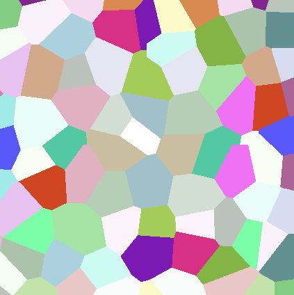
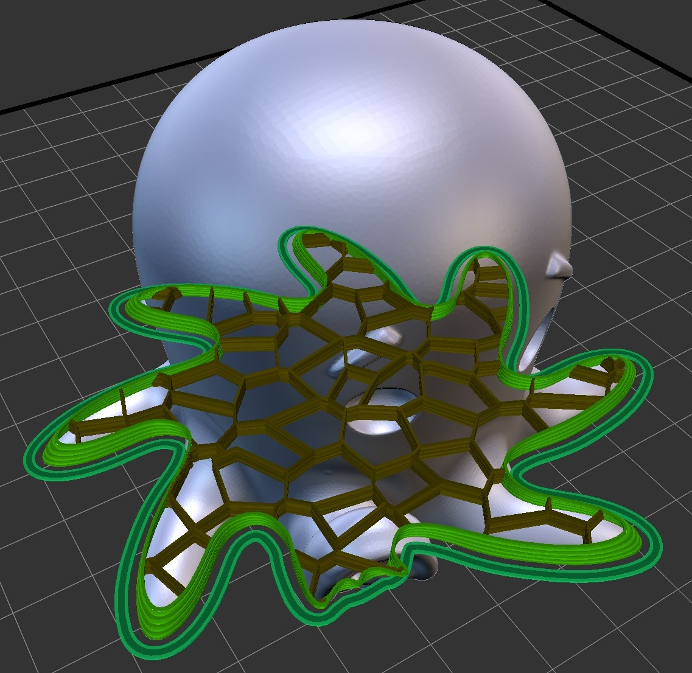
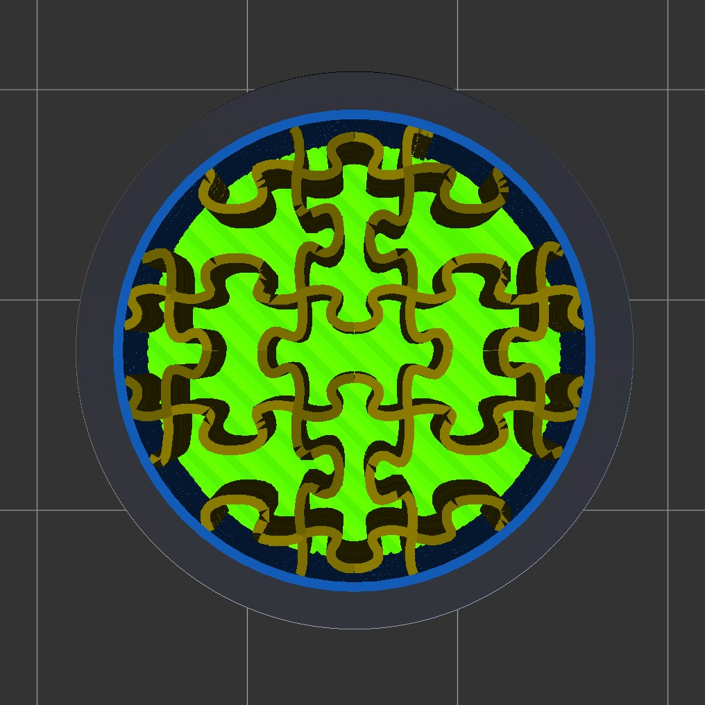

# icesl-infillers

### This feature is in beta and subject to change.

Infillers answer the problem of designing custom infill patterns. This is useful for customizing the infill for a specific part, for infill research, and for coming up with fun, interesting fill patterns!

A difficulty in designing your own infill is how to specify the paths themselves. Indeed, infill patterns are usually made of single deposition tracks, so specifying them as volume meshes or implicit volumes does not work well. In addition, the infill pattern may involve several crossing deposition tracks, and potentially varies according to e.g. a specified density field (to increase/decrease the fill percentage locally within the part).

We propose two solutions to specify custom infillers.

## Infill shaders

These are shaders (in GLSL) that can be used to create your own infill patterns in IceSL. The idea is to describe the infill as colored cells, where a cell simply is a connected region having a same color. The color itself does not matter. What matters are the *boundaries* between the colored cells. These become the infill print paths. The figure below illustrates this idea.

<p align="center">
 
</p>

*A 2D Voronoi infill. Left: colors computed by the shader. Right: Paths extracted during slicing. The paths are the frontiers between the colored cells. Try it on https://www.shadertoy.com/view/XdKBzc*

This is a versatile approach that can be used to describe many infill patterns, from regular to irregular and foam-like structures. This has many advantages: the infill shaders are fully procedural, they can be used to create a variable infill, and could even be deformed by changing the input coordinates (warping).

An infill can be produced in multiple passes, so as to obtain crossing continuous paths. Each pass is done independently, and paths are extracted before going to the next pass.

An infill shader has access to some fields:
- the infill percentage parameter (constant, per-layer or field).
- the nozzle diameter.
- the layer height.
Access to other fields will be added in the future.

Each infiller is a single file named _shader.glsl_ stored in a subdirectory of icesl-infillers. These are automatically loaded into the UI. The icesl-infillers directory should be in %appdata%\IceSL (Windows) or ~/.icesl (Linux).

### Implementation

The shader has to implement the following function:
```glsl
vec4 cellular( vec3 world )
```

This takes as input a 3d point in world space coordinates (coordinates from the 3D scene in millimeters). The return value is a color (RGBA). Again the color itself does not matter, what matters is that a boundaries between two colors will produce a print path. You do not have to worry about resolution, this is dealt with by IceSL. Simply keep in mind the coordinates are in millimeters.

The shader can optionally specify a number of passes:
```glsl
int numPasses = 2; // number of required passes
```

The shader will receive the current pass being processed by declaring a uniform:
```glsl
uniform int u_Pass; // pass being rendered: 0,1,...,numPasses-1
```

### Accessing additional fields

The layer height parameter (_layer_height_) can be accessed as follows:
```glsl
float l = layer_height();
```

The nozzle diameter parameter (_nozzle_diameter_) can be accessed as follows:
```glsl
float n = nozzle_diameter();
```

The infill percentage parameter (infill _density_) can be accessed as follows:
```glsl
float d = density(world);
```
This returns the infill percentage value at point 'world'. Keep in mind this parameter can be either constant, varying per-layer or controlled by a field.
The returned value is in [0,100] (percentage). The shader can interpret it freely ; but of course users expect it to represent the percentage of infill volume within the part.


### UI infiller parameters

Infiller shaders have the possibility to specify variables that can be then controlled through IceSL's UI, similar to printing parameters. These variables are specified as follows:

```glsl
uniform {bool|int|float} ui_{parameter_name} = {parameter_value} // {parameter_tooltip};
```

Their declaration in shaders must be written in a single line and only boolean, integer and float types are allowed. A comment at the end of the line is also possible. Their UI component will show up in the _Brush_ section when their respective infiller is selected. Their usage inside the shader is the same as a normal _uniform_ variable.

## Infill images

Not everyone is proficient writing GLSL shaders, therefore custom infills can also be specified with image files. The principle is the same as with infill shaders; cells are specified in the image as colored shapes. See the following infill image (included in IceSL) as an example:

<p align="center">
 
</p>

Specifically, a file named _cells.png_ stored in a subdirectory of icesl-infillers will register as a custom infill in IceSL. The PNG image must be 24 bits, this means there is no transparency information in the image file. It is heavily recommended that the image can be tiled (i.e., horizontal and vertical borders match each other). This ensures the custom infill is applied properly when the geometry is big enough to trigger a repetition of the image.

It is *strongly recommended* that the infill image is created with **no antialiasing**. Antialiasing softens the borders of the infill pattern by employing a color gradient that itself introduces many pixels with different colors. These colors make the pattern borders fussy and unintentionally throw off the algorithm in IceSL, resulting in really long calculation times. 

Finally, how big the infill image is with respect to the geometry is defined by the printing parameter _Infiller image pixel size (mm)_ -- internal name **labeling_mm_per_pixel**. This specifies how big a pixel is in millimeters.

Custom infillers are meant as a research tool, but we are hoping to see your infills being contributed! Feel free to ask for pull requests.
